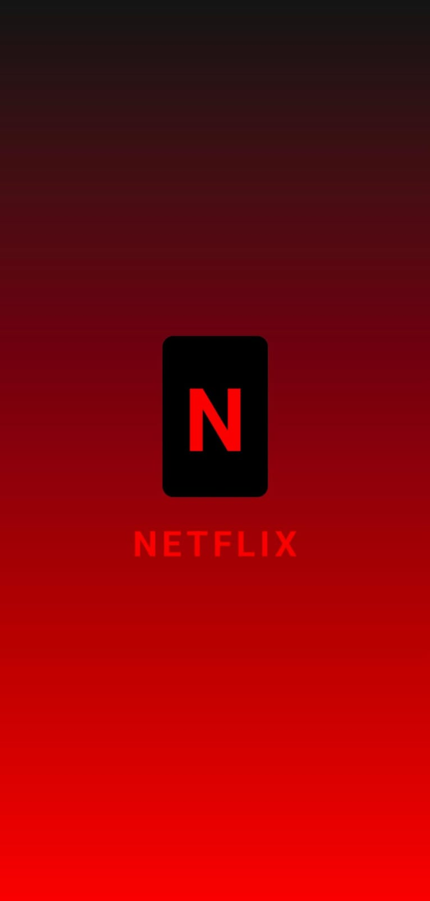
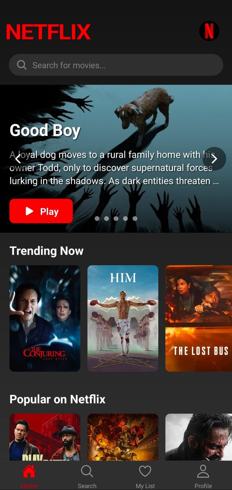
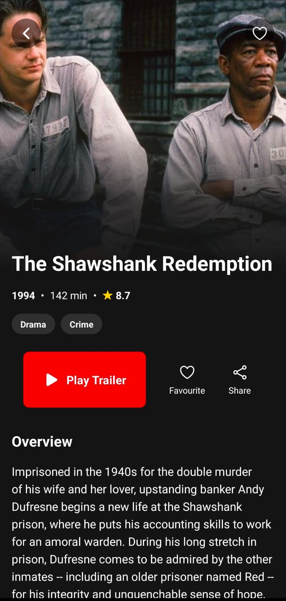
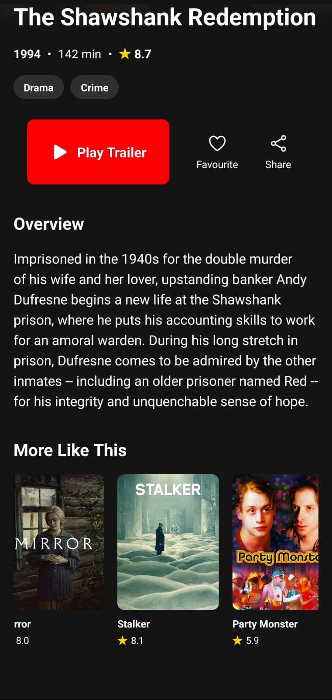
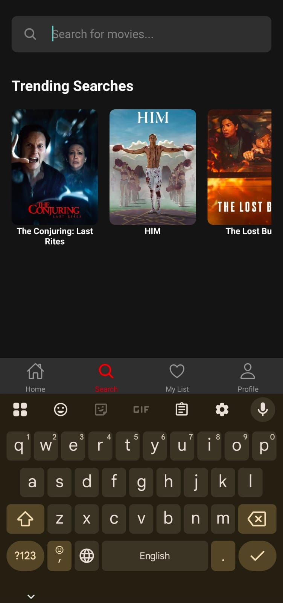
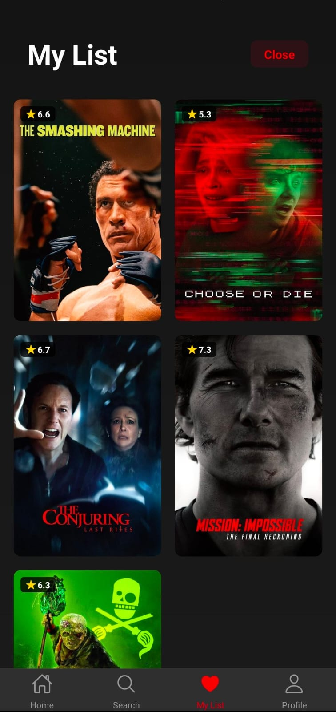
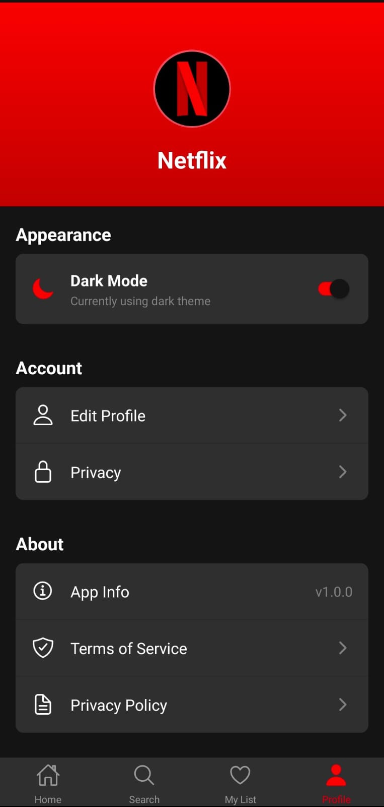
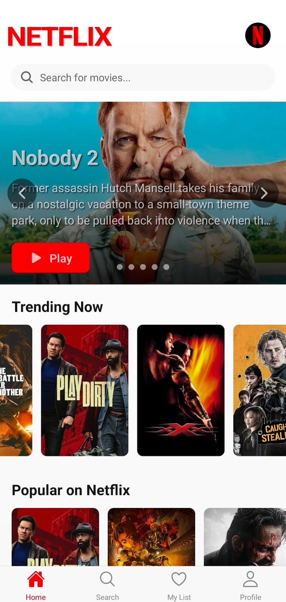

# 🎬 Netflix Clone (React Native + TMDB API)

A sleek and responsive **Netflix Clone App** built with **React Native**, powered by the [**TMDB API**](https://developer.themoviedb.org/).  
Browse movies, view details, search, explore similar titles, and manage your favorites — all in a modern UI inspired by Netflix.

---

## 📱 App Screenshots

<table>
  <tr>
    <td align="center">
      
      <br><b>Splash Screen</b>
    </td>
    <td align="center">
      
      <br><b>Home Screen</b>
    </td>
    <td align="center">
      
      <br><b>Details Screen</b>
    </td>
  </tr>
  <tr>
    <td align="center">
      
      <br><b>Similar List Screen</b>
    </td>
    <td align="center">
      
      <br><b>Search Screen</b>
    </td>
    <td align="center">
      
      <br><b>My Favourites</b>
    </td>
  </tr>
  <tr>
    <td align="center">
      
      <br><b>Settings Screen</b>
    </td>
    <td align="center">
      
      <br><b>Light Theme</b>
    </td>
  </tr>
</table>


---

## ⚙️ Features

- 🎞 Browse Trending and Popular Movies  
- 🔍 Search for Movies by Title  
- 📄 Detailed Movie Info and Cast  
- 💾 Add to Favorites List  
- 🌗 Light and Dark Mode Support  
- ⚡ Powered by [TMDB API](https://developer.themoviedb.org/)  

---

## 🚀 Getting Started

> **Note:** Make sure you’ve completed the [React Native Environment Setup](https://reactnative.dev/docs/environment-setup) before proceeding.

### 1️⃣ Start the Metro Server

```bash
# Using npm
npm start

# OR using Yarn
yarn start

2️⃣ Run the App

Keep Metro Bundler running, then open a new terminal and run:

For Android
npm run android
# OR
yarn android

For iOS
npm run ios
# OR
yarn ios

🧩 Tech Stack

React Native

TMDB API

React Navigation

Axios

AsyncStorage

React Native Vector Icons

🧠 Learn More

React Native Docs

TMDB Developer Docs

React Navigation

📝 License

This project is for educational and personal use only.
Movie data and images are provided by The Movie Database (TMDB).

💡 Author

Developed with ❤️ by Hafiz Basit Khan


---
